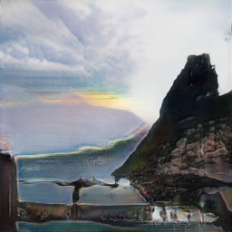
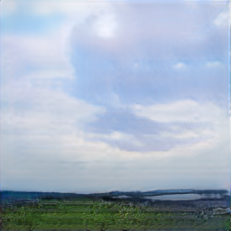
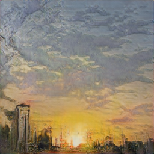
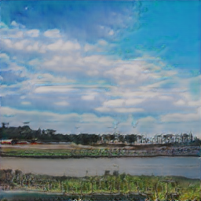
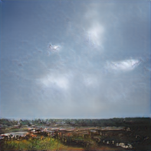
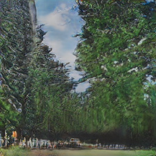

# keyword_gan

Instagram 의 태그를 크롤링하여 저작권 없는 이미지를 생성하는 GAN 프로젝트입니다.

## Blueprints

```
  +---------+        +---------+        +---------+
  |  image  |------->|  train  |------->|   NDI   |
  +---------+        +---------+        +---------+
320x320(10k~30k)   Progressive GAN    Generate 256x256
```

## Description

### Image

Instagram 으로부터 태그 기반의 320x320 이상 사이즈의 이미지를 수집합니다.

중간에 수집이 끊길 경우를 대비해서 멱등성을 고려하여 수집 작업을 진행합니다.

수집이 끝난 이미지의 메타 정보도 함께 크롤링하여 스팸 사진을 솎아냅니다.

### Train

facebook 에서 개발한 pytorch_GAN_zoo 오픈 소스를 참고했습니다.

Progressive GAN 모델을 사용해서 데이터 학습을 진행합니다.

수집한 320x320 이미지를 256x256 으로 리사이징 한 후

Generator 및 Discriminator 스케일을 16 부터 차례로 256까지 늘립니다.

GPU 메모리 사이즈를 잘 고려해서 진행합니다.

256x256 사진을 miniBatchSize 값을 16으로 해서 GTX 3080 에서 정상적으로 학습됩니다.

풍경 사진을 위주로 전체적인 학습은 DTD 데이터셋 학습과 유사하게 진행했습니다.

### NDI

이미지 스트리밍 및 영상 제작자와의 협업을 위해 NDI 프로토콜을 사용합니다.

NDI 오픈 소스를 참고하여 컴파일 된 Python 래퍼를 통해
Pytorch 의 텐서 객체를 이미지로 변환하여 실시간 전송합니다.

DLL이 제공되므로 Windows 에서만 NDI 관련 모듈이 동작합니다.


## Usage

- insta_tag_crawl.py 실행

```
python insta_tag_crawl.py --tag-name 풍경사진 --save . --size 320
```

- pggan_train.py 실행

```
python pggan_train.py --tag-name 풍경사진 --saved-dir .
```

- pggan_stream.py 실행 (Windows 에서만 동작됨)

```
python pggan_stream.py --tag-name 풍경사진
```

## Samples






